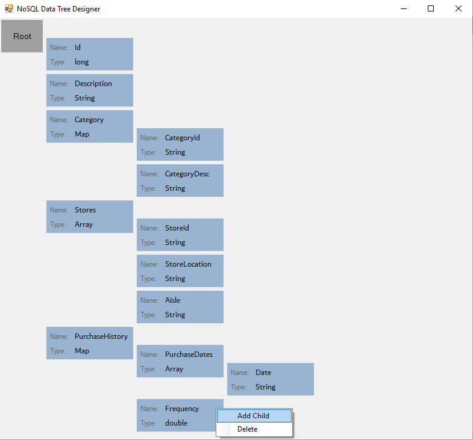

## NoSQLDataTree

This is a simple .NET program written in C# that allows the user to visually map NoSQL database schema. It internally uses a customized linked list style data structure and makes frequent use of recursion for updating data elements and the layout.

